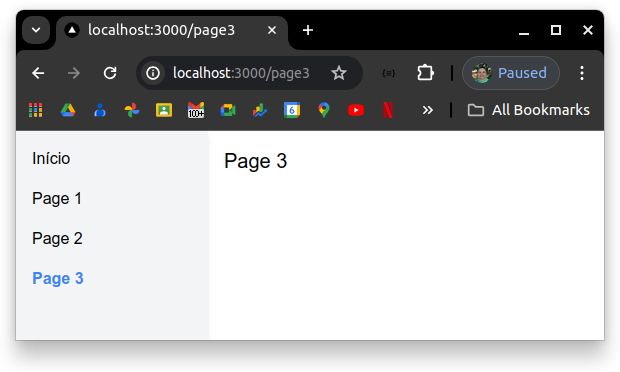

# Exercício para roteamento, no escopo do NextJS, com base no pathname

Esse exercício deve considerar o clone do código público disponibilizado no repositório [https://github.com/alexpaulooliveira/nextjs_exerc__router_pathname__start_point](https://github.com/alexpaulooliveira/nextjs_exerc__router_pathname__start_point) como ponto de partida. 

### Como baixar o exercício proposto:

Estando na pasta à partir da qual você deseja que o conteúdo seja baixado, execute o seguinte comando:

```
git clone <endereço do repositório>
```

Depois, crie uma nova aplicação NextJS (sugestão: com o auxílio do Tailwind CSS), objetivando responder as questões propostas abaixo:

## EXERCÍCIO

### 1) Configure a sua máquina com as últimas versões do *nvm*, do *node* e do *npm*. Sugestão: execute o *purge* das versões atuais desses aplicativos, e siga as instruções da página oficial do *NodeJS*.

### 2) Gere uma aplicação com um *layout* similar ao que pode ser visto na imagem abaixo. DICA: O *Tailwind CSS* pode ajudar bastante. A *API Styled Components* também é uma boa opção para estilizar sua aplicação.

